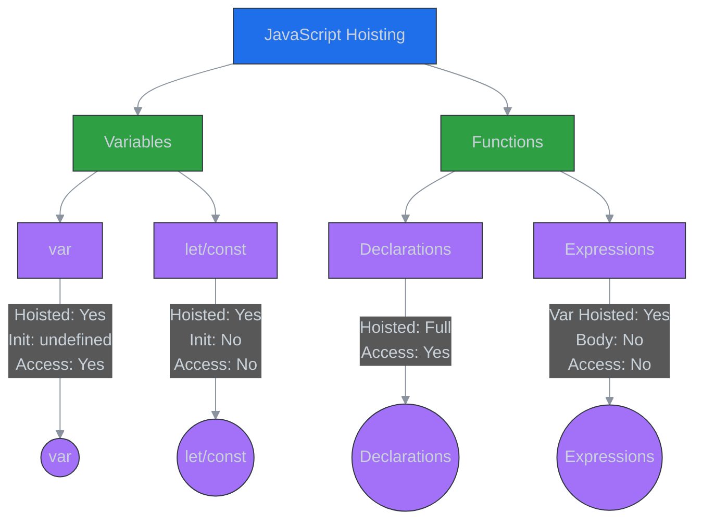

```mermaid
%%{init: {'theme': 'dark', 'themeVariables': { 'primaryColor': '#1f6feb', 'secondaryColor': '#2ea043', 'tertiaryColor': '#a371f7', 'mainBkg': '#0d1117', 'textColor': '#c9d1d9', 'lineColor': '#8b949e', 'nodeBorder': '#30363d' }}}%%
graph TD
    A[JavaScript Hoisting] --> B[Variables]
    A --> C[Functions]

    B --> D[var]
    B --> E[let/const]

    C --> L[Declarations]
    C --> M[Expressions]

    D --> |"Hoisted: Yes<br>Init: undefined<br>Access: Yes"|F((var))
    E --> |"Hoisted: Yes<br>Init: No<br>Access: No"|G((let/const))
    L --> |"Hoisted: Full<br>Access: Yes"|N((Declarations))
    M --> |"Var Hoisted: Yes<br>Body: No<br>Access: No"|Q((Expressions))

    classDef default fill:#0d1117,stroke:#30363d,color:#c9d1d9;
    classDef primary fill:#1f6feb,stroke:#30363d,color:#c9d1d9;
    classDef secondary fill:#2ea043,stroke:#30363d,color:#c9d1d9;
    classDef tertiary fill:#a371f7,stroke:#30363d,color:#c9d1d9;

    class A primary;
    class B,C secondary;
    class D,E,L,M tertiary;
    class F,G,N,Q tertiary;
```